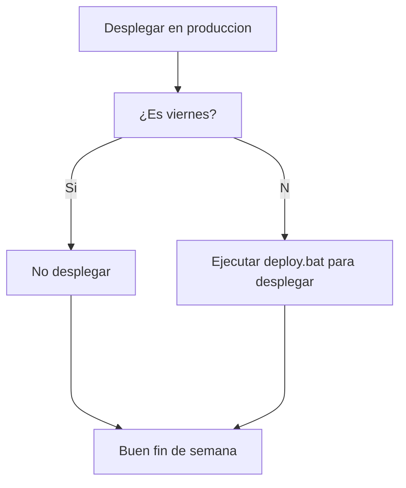

## Prueba de un diagrama en Markdown usando Mermaid

Le siguiente código es una prueba para el uso de un diagrama en un archivo Markdown:

El siguiente código es una prueba un poco mas complicada de un diagrama en un Markdown:

